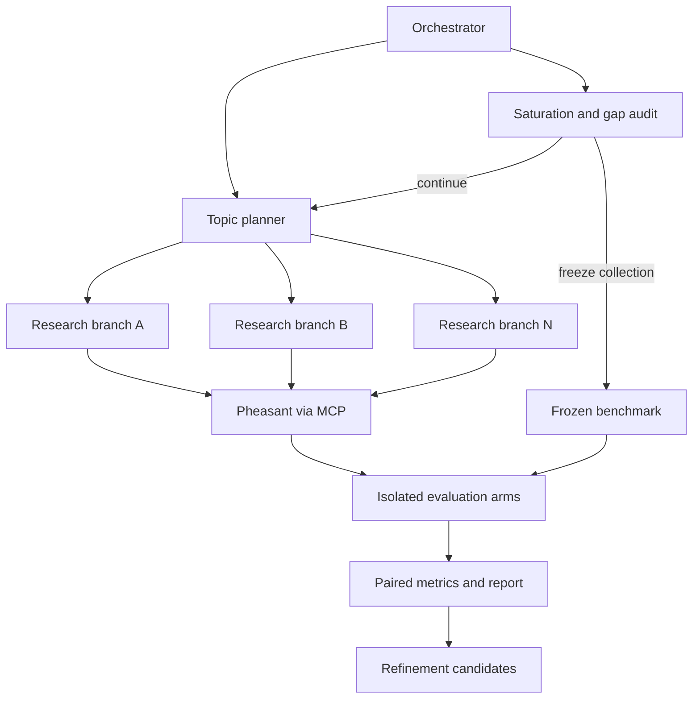
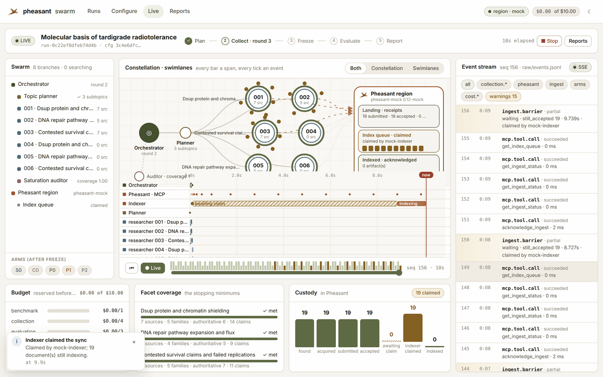
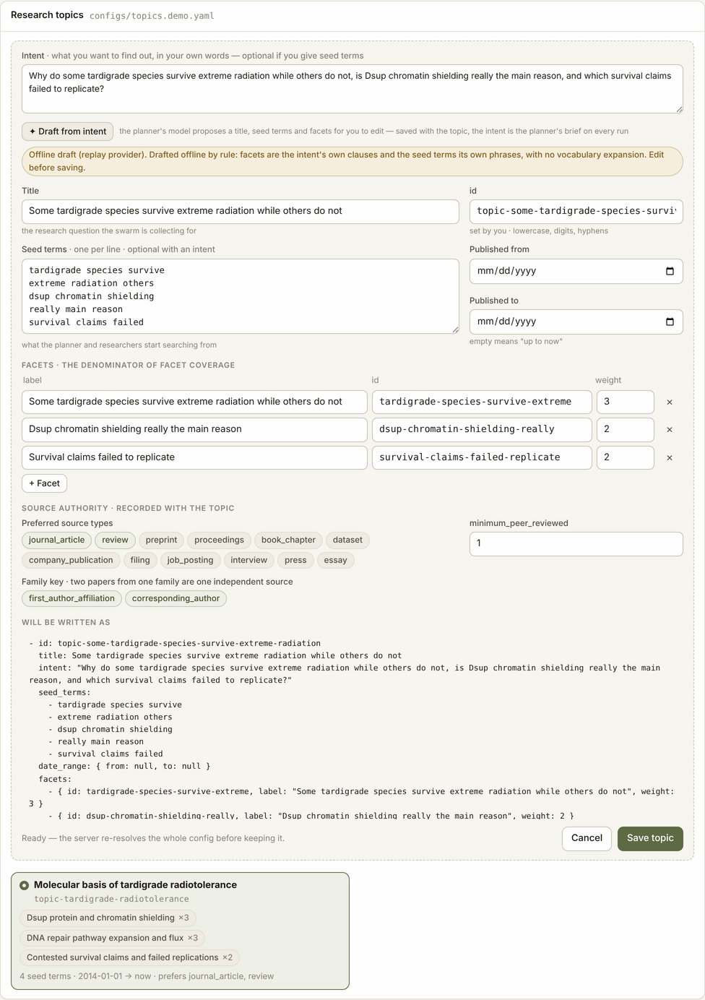
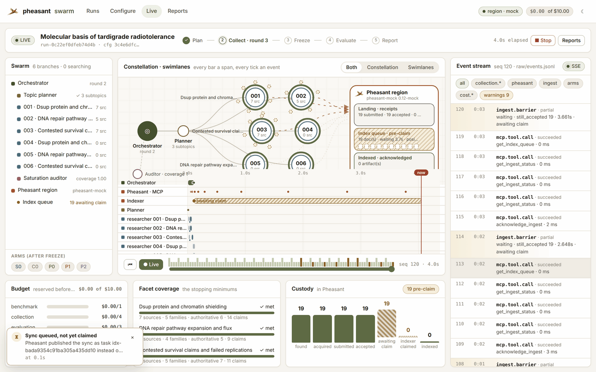
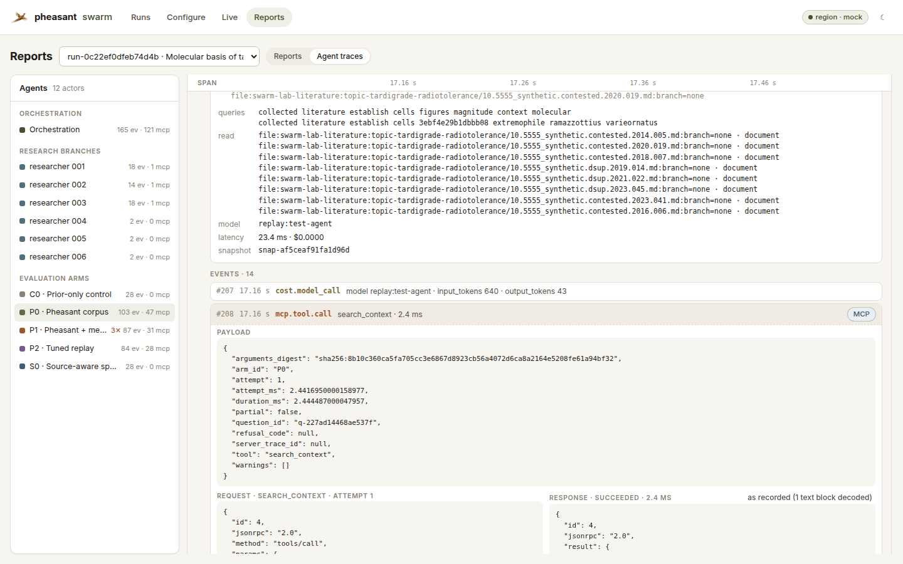

# Pheasant Scientific Swarm Evaluation Lab

Stress-test a [Pheasant](https://github.com/esatt10/pheasant-kb) knowledge
region with hierarchical research swarms — over peer-reviewed literature, the
open web, or both (see [collection profiles](#three-collection-profiles)) —
then find out whether a
**fresh agent with nothing but Pheasant** can rival the source-aware specialist
that built the collection.

One laptop. No Kafka, no hosted database, no observability service. A default
run budget of **USD 10.00**, enforced by a guard that reserves before every
call rather than reconciling after.

```bash
./scripts/bootstrap.sh
uv run pheasant-lab demo --config configs/demo.yaml   # offline, free, end to end
```

Or in Docker, with a real Pheasant 0.13.5 region beside the console — the
first run is still free (fixture literature, replay models) and every document
is genuinely submitted, indexed and searched ([docs/docker.md](docs/docker.md)):

```bash
cp .env.docker.example .env        # two random keys
docker compose up -d --build       # console: http://127.0.0.1:8770, MCP: /mcp
```

Everything a run can be given — search, budget, models and reasoning level per
agent role, the Pheasant connection, topics — is configurable from the console,
its HTTP API and its MCP tools, and every field explains itself
([docs/mcp.md](docs/mcp.md)).

---

## What this repository is for

It answers five questions and **refuses to blend them into one score**:

| | Question | Where the answer lives |
|---|---|---|
| **Collection** | Did the swarm gather a broad, authoritative, non-redundant, traceable body of sources? | `reports/collection.md` |
| **Persistence** | Did Pheasant receive and index the intended information without silent loss, duplication or scope leakage? | ingest receipts, `reconcile`, the `core` gate set |
| **Retrieval** | Can a stateless agent find the right evidence with no access to the research trace? | `known_positive_recall_at_k`, `negative_exposure_at_k` |
| **Answering** | Can that agent answer a frozen question set as well as the specialist? | `fact_f1`, the non-inferiority decision |
| **Learning** | Do memory and query tuning improve held-out performance, merely repeat learned questions, or cause regressions? | the `learned` / `temporal_holdout` cohort split |

Three things this repository will not do, anywhere, at any threshold:

* call **corpus similarity** truth,
* call **exposure** success,
* call a score computed over **sparse evidence** accuracy — a metric that
  cannot carry its denominator reports `insufficient_evidence` with
  `value: null`, never `0.0`.

---

## The five arms

| ID | Arm | What it may see | What its delta means |
|---|---|---|---|
| `S0` | Source-aware specialist | the collected sources and the research trace | the attainable reference — **not** ground truth; it is scored by the same rules and can be wrong |
| `C0` | Prior-only control | the model's prior, nothing else | separates model knowledge from Pheasant's contribution |
| `P0` | Pheasant corpus baseline | Pheasant search, memory and steering **off** | what the indexed corpus is worth |
| `P1` | Pheasant with memory | the same snapshot, memory and steering **on** | the memory-attributable effect |
| `P2` | Tuned-search replay | first-pass retrieval evidence may tune the query strategy | the query-adaptation effect |

Reported comparisons: `P0 − C0`, `P1 − P0`, `P2 − P1`, `P1 − S0`, `P2 − S0`.

**Isolation is enforced in code, not remembered.** `arms/base.py` declares
what each arm may be constructed with and raises if it is handed anything
else. A Pheasant arm never receives source URLs, the topic plan, the
specialist's notes, the expected answers, another arm's response, or another
arm's tool trace.

### "Rivals the specialist" is not "scored higher"

`P1` or `P2` rivals `S0` only when all six hold:

1. the lower paired confidence bound is no worse than the configured margin;
2. fact precision, evidence support, citation validity and abstention gates pass;
3. no ACL, temporal, stale-memory or leakage gate fails;
4. it holds on the **temporal holdout**, not only on learned replay;
5. cost and latency stay within budget;
6. no protected question type regressed under the mean.

---

## How a run goes



```bash
# Verify the laptop, the models, the providers and the Pheasant capability map.
uv run pheasant-lab doctor --config configs/experiment.yaml

# Project cost without a model or ingest call.
uv run pheasant-lab plan --config configs/experiment.yaml --topic "<topic>"

# Collect and ingest.
uv run pheasant-lab collect --config configs/experiment.yaml --topic "<topic>"

# Audit saturation; then freeze.
uv run pheasant-lab audit --run <run_id>
uv run pheasant-lab freeze-benchmark --run <run_id>

# Run the isolated arms.
uv run pheasant-lab evaluate --run <run_id> --arms S0,C0,P0,P1,P2

# Rebuild every projection from the raw events alone.
uv run pheasant-lab replay --run <run_id>

# Verify hashes, lineage, pairing, leakage and gates.
uv run pheasant-lab verify --run <run_id>

# Render Markdown, CSV and JSON reports.
uv run pheasant-lab report --run <run_id>
```

Every mutating command takes `--resume`, `--dry-run` and `--max-cost-usd`. A
resumed run uses the **original** resolved-configuration digest unless you
pass `--fork`: resuming under a changed configuration produces one run
directory whose halves are not comparable, and nothing downstream could tell.

---

## Three collection profiles

`collection.profile` decides which evidence a run collects and what counts as
**authoritative** for the stopping calculus's `minimum_review_or_primary_sources`:

| Profile | Providers | Admits | Authoritative means |
|---|---|---|---|
| `scholarly` (default) | OpenAlex, Crossref, arXiv, PubMed | journal articles, preprints, reviews, proceedings, datasets | peer-reviewed |
| `web` | Brave, Tavily | company publications, filings, job postings, interviews, press, essays, forums, unclassified pages | primary: the organisation's own statement, a filing, a posting, a practitioner interview |
| `balanced` | OpenAlex, Crossref, Brave, Tavily — each capped per query | scholarly types plus web primary and secondary (no forums or unclassified pages) | peer-reviewed **or** primary |

```bash
COLLECTION_PROFILE=web uv run pheasant-lab plan --config configs/experiment.example.yaml
uv run pheasant-lab collect --config configs/experiment.example.yaml --set collection.profile=balanced --topic <topic>
```

`configs/topics.example.yaml` carries two scholarly topics and one written for
the web profile (`topic-forward-deployed-engineering`), whose evidence is
mostly company writing, filings, job postings and interviews.

A profile supplies **defaults** for the keys it governs (providers, admitted
and authoritative types, agent/round/source limits, the per-provider cap, and
four stopping minimums — the full table is `src/pheasant_lab/profiles.py`).
A key stated in the experiment file or with `--set` always wins. Runs under
different profiles have different `config_digest`s, so they are never compared
by accident.

Web results carry no type, so each is classified from its URL by a stated rule
kept in the record (`raw.classified_by`); nothing matched is `web_page`, not a
guess. Independence is organisational: a family is the registrable domain, and
a hosting platform (Substack, Medium, a job board, YouTube) is keyed by author.
Web providers retain the search API's snippet, never a fetched page, and bill
per request — `plan` reports it as `search_api_usd`. At the default $10
budget a full `web` run's worst-case search fees alone (~$4) exceed the 40%
collection allocation, and the ledger refuses searches past it: raise
`cost_budget_usd` or lower the round limits for a full web collection. A configured web provider with no key (`BRAVE_SEARCH_API_KEY`,
`TAVILY_API_KEY`) is a `doctor` finding.

## Collection stops for a reason, and says which

Collection may report `sufficient` only when **every** hard condition passes:
facet minimums (sources, independent families, and authoritative sources —
peer-reviewed, primary, or either, depending on the collection profile),
provenance completeness, the ingest receipt rate, critical contradictions
resolved or converted into benchmark uncertainty cases, marginal unique-claim
yield below threshold for the configured window, the evaluation reserve
intact, no unassigned critical gap, and the duplicate rate under its ceiling.

Running out of money or time produces `stopped_budget_incomplete` or
`stopped_time_incomplete`. Those are not failures. Reporting `sufficient` when
they are true would be.

Two things the calculus refuses to conflate:

* **Six papers from one lab are one family.** A source count that looks
  healthy beside a family count of 1 is concentration, not coverage.
* **A declining marginal yield means this search direction is exhausted.** It
  is compatible with having missed the field entirely.

---

## The benchmark is frozen before the first arm runs

`benchmark/` holds `questions.jsonl`, `expected-facts.jsonl`,
`expected-evidence.jsonl`, `exclusions.jsonl`, `abstention-cases.jsonl`,
`cohort-membership.jsonl` and a manifest digesting every one of them. The
frozen files carry **no run stamp**: two runs over the same corpus produce
byte-identical questions, so "the same question in two runs" is the same
question and a trend line exists.

Every required fact carries **its own deterministic matcher**. A fact nobody
can match deterministically is not eligible as an operand and is reported as
an *exclusion* — never as a miss. A miss says the arm failed; an exclusion
says the benchmark could not judge.

Five leakage checks run before evaluation, and an invalidating finding
invalidates the affected comparison until the set is re-frozen:

1. the question's own wording satisfies its expected fact;
2. a question matches a research prompt, a memory record or a tuned alias;
3. a holdout or control question created the treatment it is used to test;
4. an abstention case has retrievable supporting evidence;
5. a benchmark file reached the Pheasant namespace.

Check 3 is the one that matters most: without it, `learned − holdout` stops
being a memorisation detector and becomes a restatement of the learned number.

---

## Every number resolves to its evidence

```text
run → agent span → source discovery → acquisition → source artifact
    → extracted claim → Pheasant ingest request → ingest receipt
    → snapshot/index state → benchmark question → arm/session
    → MCP search call → returned context → answer → answer claim/citation
    → proof event → metric operands → aggregate delta → report statement
```

Raw JSONL is **authoritative and append-only**. The DuckDB file is a
disposable projection rebuilt from it; a projection error never mutates a raw
trace. Corrections supersede — a crossed index barrier appends a new receipt
row rather than editing the old one, and readers fold the file by key.

The acceptance test this repository sets itself, and which
`tests/integration/test_end_to_end.py` walks: a reviewer starts at one sentence
in `summary.md`, resolves it to an aggregate, inspects its per-question values,
locates the exact Pheasant result and ingest receipt, traces that result to its
source and locator, and sees every error and exclusion that touched the
denominator.

### Typed proof

Served, considered, included and **`not_selected`** are *unknown*, weight zero.
A reader may have found the answer at rank one, and treating silence as a
negative manufactures negatives at exactly the rate the region serves results.
Weight is the product of four **reported** multipliers — directness,
independence, specificity, recency — and positive and negative sums never
cancel: `P`, `N`, `Net` and a conflict rate are published separately.

### Gates are not metrics

Gates are evaluated **before** aggregation, so a good score cannot offset a
failed one. A gate set cannot be constructed empty — `all([])` is `True` — and
a verdict is **tri-state**: `PASS` requires that every gate in the set was
*evaluated* and passed. A set with three of four gates skipped reports
`INCOMPLETE (1 of 4 gates evaluated)`, because an unchecked box and a failed
one are equally disqualifying for a result somebody will publish.

---

## Running it against real Pheasant

1. Start Pheasant and note its MCP endpoint.
2. `cp .env.example .env` and fill in `PHEASANT_MCP_URL`, the matching
   `PHEASANT_API_TOKEN` from the Pheasant server environment, the model provider
   and its key, and the tool names if your build renames any. For the `web` or
   `balanced` profile also set `BRAVE_SEARCH_API_KEY` and/or
   `TAVILY_API_KEY`; a configured provider without its key is a `doctor`
   finding. `plan` reports their per-request fees as `search_api_usd`.
3. `uv run pheasant-lab doctor --config configs/experiment.yaml` — it fails
   before any spend when a required capability is missing, a configured tool
   is absent from `tools/list`, a model has no price, or the adapter cannot
   satisfy a tool's advertised schema.

Tool names are **configured, not assumed** (`configs/pheasant-mcp.example.yaml`).
Pheasant's own docs say to read the readiness contract before hard-coding a
tool name; this lab does the equivalent at preflight and refuses rather than
guessing. Heuristic name matching is off by default.

The lab writes to a knowledge base and a source it owns. Use a namespace that
holds nothing else: it submits documents and seals snapshots there.

**What the region needs** (pheasant >= 0.12.6; checked end to end against
0.12.16, 0.13.0, 0.13.1, 0.13.2 and 0.13.4, the last two both standalone and
role-split; the shipped pheasant file targets 0.13.5, whose MCP surface is
0.13.4's - it adds only pheasant-kb's documentation of this lab):

* `readiness.enabled: true` — `submit_documents`, the receipts and snapshots
  live on the readiness plane;
* its state path allow-listed, e.g. `security.allow_workspace_roots: [/state,
  …]`. Pheasant lands submitted documents under `<state>/uploads/<source>` and
  leaves registering that directory to the caller; the lab registers it before
  the first sync, and a region that refuses says so with this fix;
* a `type: memory` source, for `P1`;
* the API token in `PHEASANT_API_TOKEN` when `security.api_auth` is on.

`deploy/compose/answers/pheasant-lab.json` in pheasant-kb sets all four.

**A role-split region (fleet).** There `sync_source` and the memory write's
sync are *published*, not run, and nothing is searchable until an indexer
claims the task. The lab waits for both: the ingest barrier polls until every
document is indexed, and from pheasant 0.13.2 (`get_index_queue`) it reports
each task's claim state while it waits and holds `P1` until its memory has
left the queue (`memory.indexed`). Against an older fleet the memory wait
cannot be confirmed, and `P1`'s report says so as a limitation.

**The region's own count (optional).** From pheasant 0.13.3 the lab asks
`describe_source` what the region holds for the lab's source once the barrier
is crossed, and records it beside the indexed receipts (`ingest.inventory`:
`consistent` or `mismatch`). Reconcile asks whether every receipt's artifact
is there; this asks the converse, which is how a duplicate or a stray file in
the landing directory shows up. The console's region chip shows the same
count, read over HTTP. Older regions simply do not report it.

**Graph neighbourhoods (optional).** Pheasant 0.13.1 can attach each hit's
graph neighbourhood to a search (`expand`), and the shipped pheasant file maps
it. Set `replay.graph_expansion` (`true`, a depth 1-3, or `{depth,
max_neighbors, edge_types, exclude_edge_types}`) and every search call records `expand_sent`, the region's
`expansion` block and each hit's `graph_neighbors`. It is recorded, not read:
no arm's answer changes. On the fixture corpus a depth-1 walk reaches only each
paper's own entities (authors, venues, genes); depth 2 reaches other papers
through those shared entities, decoys included. `doctor` refuses a run that
asks for expansion the pheasant file cannot send. Against pheasant
0.12.6-0.13.0, unmap it (`--set argument_map.search.expand=null`, or delete the
line): a mapped argument the region's search tool does not take fails `doctor`.

**One evaluation per sealed snapshot.** `P1` writes memory into the region,
and in pheasant a memory record is an indexed artifact — so it moves the
snapshot's `corpus`, `graph` and `retrieval` sections, not just `memory`. A
second `evaluate` over the same run therefore has its pinned `P0` refused and
fails its drift gate, naming those sections. That is the pin doing its job;
start a new run (or a fresh region) to evaluate again.

---

## The offline demo, and what it does not measure

`pheasant-lab demo` runs the whole pipeline with no network, no key and no
cost: fixture literature, an in-process Pheasant-shaped MCP region, and a
deterministic rule-based provider.

It exercises the plumbing — the handshake, capability resolution, ingestion,
the index barrier, the freeze, five arms, the metric engine, the gates, the
projection and every report. It **does not measure Pheasant**, and the reports
say so in their own limitations section:

* the mock region is BM25 over what was submitted, with no vector or graph arm;
* the deterministic provider has **no prior knowledge**, so `C0` abstains
  everywhere and `P0 − C0` is a *floor* on the corpus's contribution rather
  than an estimate of it;
* the fixture corpus is synthetic and says so in its own header. A fixture
  whose known-positives were written by the seeding script would produce
  numbers that measure the seeding script.

A demo run typically ends with `hard_gates: INCOMPLETE` — the ACL and
stale-memory gates have nothing to test in a region with no ACL enforcement and
no superseded records. That is the tri-state working, not a bug: *"nothing is
wrong here"* and *"this is ready to be measured"* are different sentences.

---

## The console

```bash
make ui                                   # once: build the UI (needs Node 18+)
uv run pheasant-lab serve                 # http://127.0.0.1:8770
```

A browser surface over everything above, in pheasant's own visual language.
The full tour is [docs/console.md](docs/console.md).



* **Configure** — a form over the YAML. Every change is a `--set`, shown as the
  exact command it will run; `plan` projects the cost as you edit, `doctor`
  runs on demand, and a change that moves the config digest says so.
* **Research topics** — start from an **intent** (what you want to find out,
  in your own words), from seed terms, or both. **Draft from intent** asks the
  planner's model (`pheasant-lab draft-topic`, under its own small budget) for
  a title, seed terms and facets to edit. Saving writes the current topics
  plus the new one to `configs/topics.local.yaml` (git-ignored; the shipped
  topics files are never rewritten). The intent is kept as the planner's
  brief on every run.

  

* **Live** — a run as it happens, from its append-only trace: phases, the
  swarm as a tree, a **constellation** (research branches with their sources
  in orbit, coloured by custody, travelling to a Pheasant node drawn as
  landing → index queue → indexed) and **swimlanes** (one per agent, the
  region and the indexer), the raw event stream, budget, facet coverage and a
  custody funnel. Every visual zooms, pans and fits. A replay scrubber folds
  the same trace at any earlier sequence number.
* **Region awareness** — on a role-split Pheasant a sync is *published*, and
  until an indexer claims it the documents are accepted and not searchable.
  The lab records that interval (`ingest.sync`, `ingest.barrier` and, where
  the region offers `get_index_queue`, each task's claim state). The console
  shows it as its own state — a hatched "awaiting claim" bar, a notice, an
  amber funnel column — rather than as an unexplained wait.

  

* **Agent traces** (Reports → Agent traces) — every actor's whole record: the
  orchestration, each research branch and each arm. Each trace shows:
  * a waterfall of its span tree, with every event in the span that recorded it;
  * each MCP call's request and response, as the region answered;
  * for an arm, its question, answer, claims and reads;
  * for a branch, the claims it extracted.

  

* **Runs** — every run directory. **Launch run** and **Resume** start the
  supervised pipeline detached: closing or restarting the console does not
  stop a run, and an interrupted one resumes from its checkpoint.

Every page is a real URL, so a reload lands where it was. The console binds
loopback because it can start paid runs.

`--set mock_claim_seconds=8` makes the offline mock behave like a fleet (a
sync is queued and claimed eight seconds later). That is how the pre-claim
path is exercised without a real region.

## Persistence and durability

**What persists a run:** its directory under `runs/`, and nothing else. No
database, no broker, no service holds state a run needs.

* `raw/*.jsonl` is the authoritative record and is append-only: events,
  spans, errors, the MCP transcript, sources, claims, receipts, questions,
  answers and proof.
* `state.json` is a checkpoint: completed stages, collection progress at its
  last round boundary, and the budget.
* `run-manifest.json` records the config digest, models and prompts.
* Metrics, reports and the DuckDB projection are derived, and rebuild from
  `raw/`.
* The console keeps its launch records as files under `runs/.console/`.

**How it survives failure:**

* Whole-file writes are atomic and `fsync`ed.
* Every checkpoint first `fsync`s the raw files it depends on.
* A line torn by a crash mid-append is cut, kept in `integrity/torn/`, and
  recorded as a `run.repaired` event.
* Transient model errors (`429`, `5xx`, timeouts) are retried with backoff.
* Collection resumes from its last round boundary over state rehydrated from
  `raw/`.
* Evaluation reuses every answer it already recorded.
* `pheasant-lab run` drives the whole pipeline and resumes any stage that
  crashes:

```bash
pheasant-lab run --config configs/experiment.yaml --topic <id>    # a new run
pheasant-lab run --config configs/experiment.yaml --resume <run>  # carry one on
```

A test kills the real CLI mid-collection and mid-evaluation, the way
`SIGKILL` does. It asserts the resumed run reaches the same corpus and the
same metrics as one that never crashed. Details, the failure table and what
this does not cover are in [docs/durability.md](docs/durability.md).

## Layout

```text
configs/     experiment (with the collection profile), models, metrics, proof policy, MCP map, logging, topics
prompts/     one file per agent role — the part you will most want to edit
schemas/     the shapes an outside reader can rely on; validated in CI
src/pheasant_lab/
  orchestration/  planner, researcher, auditor, stopping calculus, orchestrator
  providers/      OpenAlex, Crossref, arXiv, PubMed, Brave, Tavily, and an offline fixture pack
  pheasant/       MCP protocol, transports, capabilities, ingest, retrieval, mock
  benchmark/      builder, freezer, leakage, question types and matchers
  arms/           S0, C0, P0, P1, P2 and the isolation they enforce
  evaluation/     metric contract, proof, metrics, pairing, statistics, gates
  tracing/        events, spans, errors, lineage, DuckDB projection
  reports/        summary, arm comparison, regressions, refinements
  console/        `pheasant-lab serve`: the live projection, launcher, region probe, HTTP,
                  topics, per-agent traces
  supervisor.py   `pheasant-lab run`: the pipeline, resuming stages that crash
ui/          the console's React app (built to ui/dist)
docs/        the console tour and the durability guarantees, with screenshots
runs/        run output (git-ignored; run content is user data)
```

## Development

```bash
make test     # offline by design; no test reaches the network
make lint
make schemas  # fail if schemas/*.json would change
make check    # everything CI runs
```

## Security, privacy and licensing

`.env`, run content, downloaded papers and raw prompts are git-ignored.
Secrets are resolved at runtime and replaced with a **stable** redaction token
in every trace — stable so a reader can tell that two calls used the same
credential from a trace containing neither. Forbidden headers are dropped
rather than masked. Full text is retrieved only where access and licence
permit; otherwise the record keeps metadata, the abstract and the canonical
locator, and says which it has. Remote telemetry export is opt-in and
configured independently. Refinement candidates are a report artifact by
default; submitting them to Pheasant requires an explicit, separate
diagnostic namespace, because a region that can retrieve its own diagnostics
can answer a question with its own report.

## Licence

See [LICENSE](LICENSE).
