# The console

```bash
make ui                      # once: build the UI (Node 18+)
uv run pheasant-lab serve    # http://127.0.0.1:8770
```

A browser surface over the CLI, in pheasant-kb's visual language. It never
computes a number a report states: the live view is a fold of `raw/*.jsonl`
done once in Python, and every run it starts is the ordinary CLI in a
detached child process. It binds loopback because it can start paid runs.

Every page is a real URL. Reloading `/configure`, `/live/<run>`,
`/reports/<run>` or `/reports/<run>/traces/<agent>` reloads that page, and
Configure keeps the overrides you made in this tab.

Every page fits the window: a long form, a run list, a report or an expanded
trace scrolls inside its own panel, while the plan, the agent list and the
waterfall's time axis stay where they are. On a narrow or short window the
pages fall back to scrolling as a whole.

## Access key

Like a pheasant-kb fleet, the console takes a shared bearer key. Put one in
`.env` (or the environment) and restart:

```bash
PHEASANT_LAB_CONSOLE_TOKEN=$(python -c "import secrets; print(secrets.token_urlsafe(32))")
```

With a key set, every `/api` call - runs, traces, launches, logs, deletion -
needs it, while the page shell stays public so it can ask for it. The browser
asks once per tab, checks the key before keeping it, and holds it in that
tab's session storage only; the top bar shows **🔓 connected** (click to
change or disconnect). The live stream is read with `fetch` so the key travels
as a header, never in a URL a proxy would log.

Without a key the console is open, which is right for loopback and refused
anywhere else: `--host 0.0.0.0` with no key exits with a refusal, unless
`--allow-unauthenticated` says an authenticating proxy stands in front of it.
`--token-env` names a different variable.

The region chip uses `PHEASANT_API_TOKEN` (from `.env` too) to ask the region
about itself, and says **Region needs a token** or **Region refused the
token** rather than going green over a region every run would be refused by.

## Logs: view, filter, delete, retain

**Logs** lists what has accumulated under the output root: every launch's log
and every run, sized by what its bytes are (trace, projection, reports,
metrics, …).

- **Read** a launch log or any text file inside a run: filter by text or by
  level, follow a running launch, page back through the rest. `Esc` closes.
- **Delete** a launch log, a run's projection (rebuilt by `pheasant-lab
  replay`), or a whole run (type its id to confirm). A run's raw trace is never
  trimmed - rule 5 - so a run is kept whole or deleted whole. Nothing a launch
  is still writing can be deleted.
- **Retain**: days and counts for launch logs, projections and runs, all blank
  (keep forever) by default. The card previews exactly what the draft would
  delete as you type; **Apply now** asks first; *apply automatically* runs it
  every ten minutes while the console is up. Runs with reports can be
  protected, and **☆ Keep** exempts one run from every rule. The policy is
  console bookkeeping (`.console/retention.json`), so it never moves a config
  digest.
- **Audit**: every deletion, by hand or by policy, with what it freed and why
  (`.console/retention-log.jsonl`).

**Run logging** (on Configure) sets `logging.yaml` per run as ordinary
overrides: level, text or JSON, an optional log file inside the run
(`logs/lab.log`, which the Logs page then lists), and whether MCP request and
response bodies are kept, up to how many bytes. These are part of the run's
configuration, so they move its digest.

## Configure

A form over the YAML and over **one settings draft** the console keeps — the
same draft its MCP tools edit ([mcp.md](mcp.md)), so a change an agent makes
shows up in the open page within a few seconds (the header says who changed it
last). Every change is a `--set`, shown as the exact command it will run.
`plan` projects the worst-case cost as you edit, `doctor` checks models,
prices, providers and the region's tools before any spend.

- **Every field explains itself.** The `?` beside a label opens what it means,
  the values it takes, its range, its default, whether it moves the config
  digest and its `--set` key. **Every setting** at the bottom lists all of them,
  filterable by text and section, with advanced fields behind a toggle.
- **Typing is yours.** A field keeps your text while it has focus and commits
  after a pause, on Enter or on blur. (It used to re-render from the resolved
  value on every keystroke, so clearing a field snapped the old value back and
  an experiment name could not be retyped.)
- **Pheasant connection.** Named regions — the in-process mock, the Compose
  region, pheasant-kb's lab fleet, loopback, the Docker host, and any you add
  with a URL, knowledge base, source, token variable and optionally the token
  itself (stored `0600`, never shown again). **Use** writes the connection's
  fields as overrides; **Probe** asks the region whether it is ready and what
  it holds for the lab's source.
- **Budget.** The hard ceiling, the time ceiling, a cap on the next launch
  only, and the five phase shares with their sum.
- **Pheasant search.** Search mode (hybrid, or one arm alone), results per
  search, search rounds per answer, a score floor and graph expansion.
- **Agents & models.** Provider, model, reasoning level and output cap per
  role, what the role does, how many calls it makes, and the recommended model
  and reasoning level with one click (or **Use recommended for all**). The
  price list sits under it: a model with no price is refused before any spend.
- **Run name.** A label for the run the next launch makes, shown in Runs.

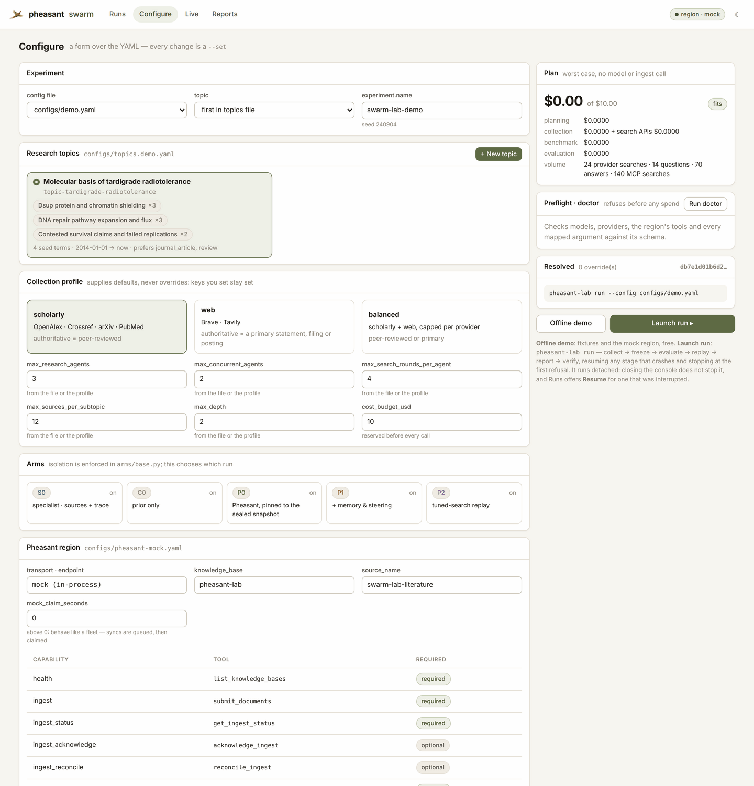

## Research topics: from an intent, from seed terms, or both

Under **Research topics**, **+ New topic** opens a form.

1. **Start from what you want to find out.** Type an *intent* in your own
   words: the question, what would settle it, what you suspect is contested.

   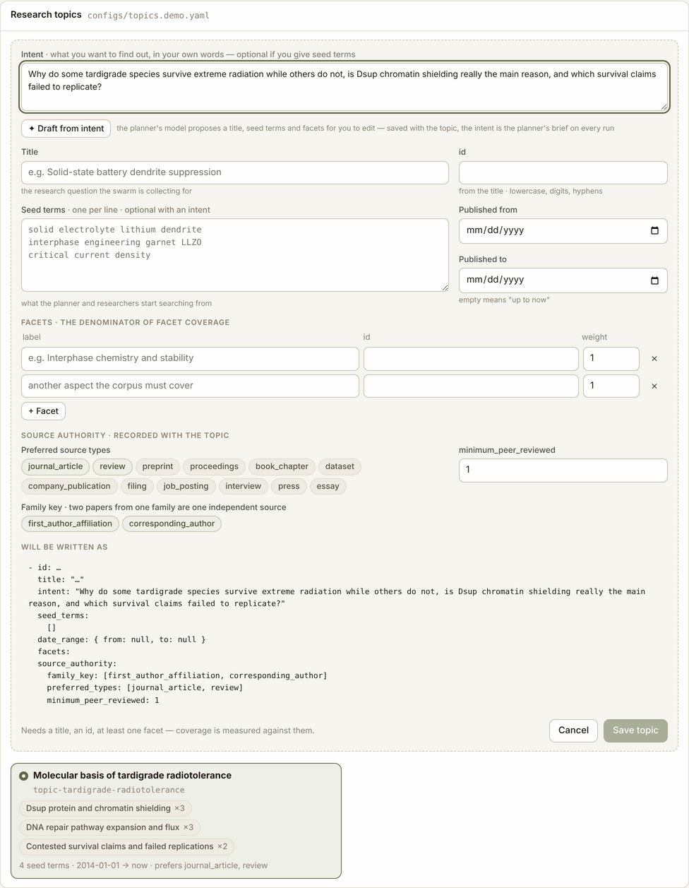

2. **Add detail, then generate.** **Details** takes what the intent leaves
   out: background, what must be covered or excluded, who the answer is for;
   the planner reads it after the intent on every run. **Generate with GPT-6.1
   Sol** or **GPT-6 Luna** drafts the topic in one click, reading everything in
   the form as context — intent, title, details, the facets you wrote, the
   window, preferred types — and **replaces** the form with the draft (it says
   which model wrote it and what it cost). **Draft with the planner's model**
   uses the configured planner instead; offline, under `replay`, that draft is
   rule-based and says so. Every call goes through `pheasant-lab draft-topic`
   under its own small budget (`--max-cost-usd`, default $0.25, reserved
   before the call), so a hosted model needs a price first.

   

3. **Edit and save.** Seed terms are optional when there is an intent, and the
   intent is optional when there are seed terms. Saving checks the topic
   against the same model `load_config` uses, writes your current topics plus
   this one to `configs/topics.local.yaml` (ignored by git; the shipped
   topics files are never rewritten), selects it, and adds
   `--set experiment.topics_file=configs/topics.local.yaml` to the run.

   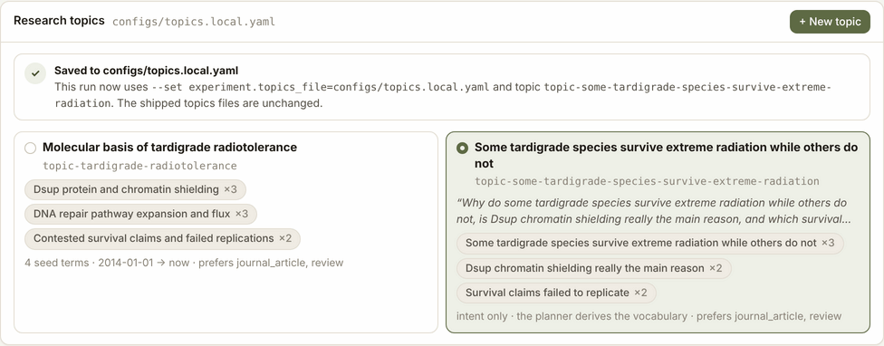

The intent is saved on the topic, and the planner reads it as the brief on
every run (`prompts/planner.md`). It is part of the config digest only when
set, so existing topics keep their runs resumable. From a terminal:

```bash
pheasant-lab draft-topic --config configs/experiment.yaml \
  --intent "Why do some tardigrade species survive extreme radiation while others do not?"
```

A topic saved from an intent alone ran end to end on the offline demo:

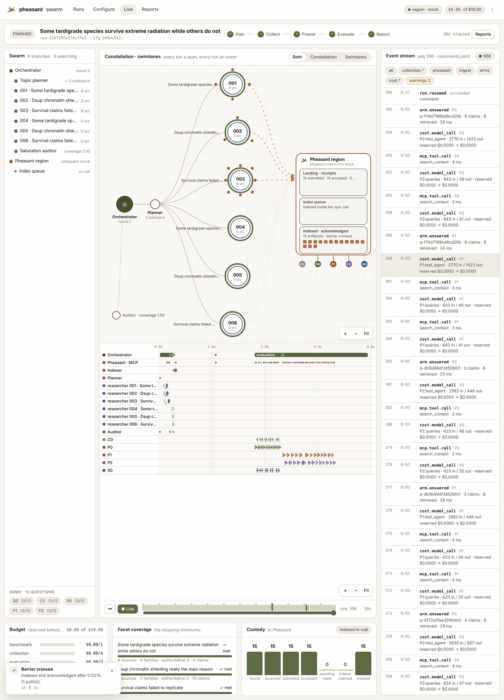

## Runs

Every run directory the console can see, with its name, notes and stages. The
**⋯** menu renames and annotates a run (console bookkeeping; the run's own
files are never rewritten), keeps it (exempt from retention), renders or
re-renders its reports, deletes its reports (derived, so re-renderable) and
deletes the whole run after you type its id. In the Docker image the list holds
only runs made in Docker ([docker.md](docker.md)).

## Live

A run as it happens, from its append-only trace. It opens on the
**constellation**; the tabs switch to swimlanes or both. the phase stepper, the swarm
as a tree, a **constellation** and **swimlanes**, the raw event stream,
budget, facet coverage and a custody funnel.

- **Constellation.** Research branches with their sources in orbit, coloured
  by custody, travelling to a Pheasant node drawn as landing → index queue →
  indexed.
- **Swimlanes.** One lane per agent, plus the region and the indexer.

On a role-split Pheasant a sync is *queued*, and until an indexer claims it
the documents are accepted but not searchable. That interval is its own state:
a hatched "awaiting claim" bar, a notice and an amber funnel column.


**Zoom, pan and fit.** Every visual has **+**, **−** and **Fit** in its
corner. On the constellation, scroll to zoom; on the timelines, Ctrl + scroll
(⌘ on a Mac), so a plain scroll still scrolls the lanes. Drag to pan. A drag
never selects the node it ends on.

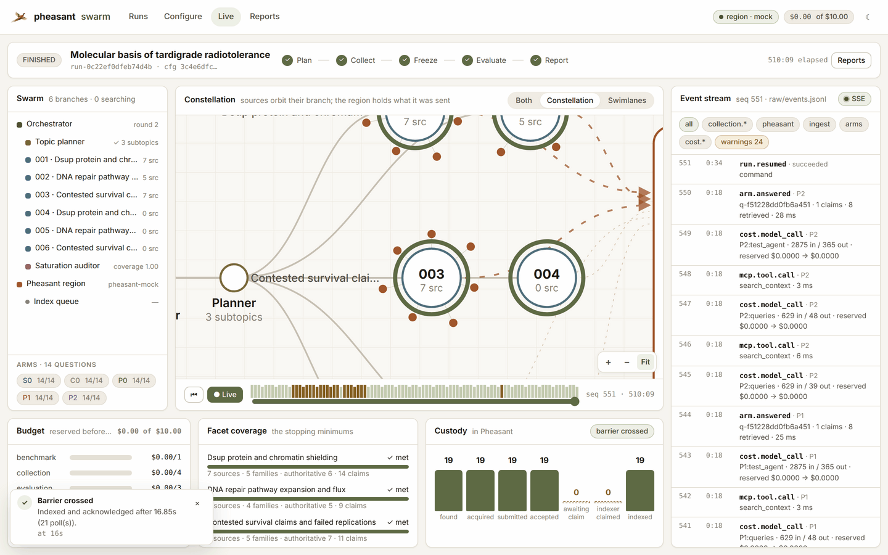

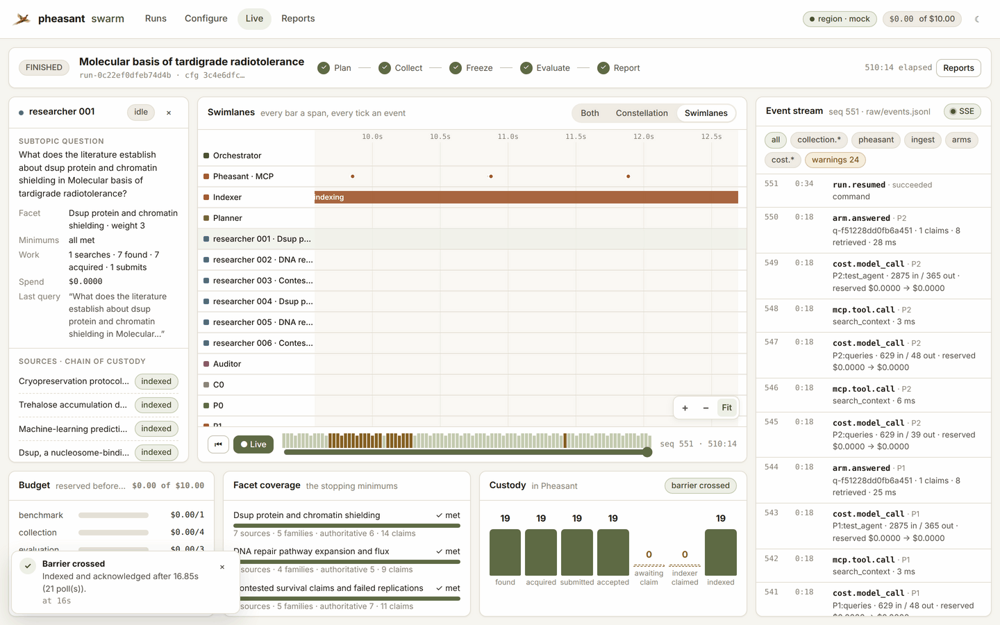

**Select, and everything filters.** Click a research branch (on the
constellation, its lane, the swarm tree or an event) or an arm (its bar in the
swarm tree, its dot under the region, or its lane). The event stream narrows
to that actor's events, the constellation and the swimlanes dim everything
else, custody and facet coverage narrow to the branch's own sources, and the
replay density bar marks where its events fall. **◎** zooms the constellation
to the selection. Deselect by clicking it again, clicking empty canvas, the
**×** on the chip in the run head or the stream, or **Esc**.

**Collapse and expand.** The swarm pane and the event stream fold to a spine
(⇤ / ⇥) and the budget/facets/custody row folds to a one-line summary; the
browser remembers which. **⤢** expands the visual to the whole page and **Esc**
brings the layout back.

**Progress.** A bar under the run head fills with the run's phases and the
active one's own evidence (answers recorded of answers due while evaluating;
documents indexed of discovered while collecting), the active phase spins
while the run is live, each arm has its own answers-due bar, and the stream
says when it is connecting, reconnecting or waiting for the access key.
Region notices sit in a strip under the visual's header instead of floating
over it; good news fades on its own, warnings stay until dismissed. A thin bar
under the top bar shows any request a person is waiting on, and pages show
their own shape while the first answer arrives.

The replay scrubber folds the same trace at any earlier sequence number.

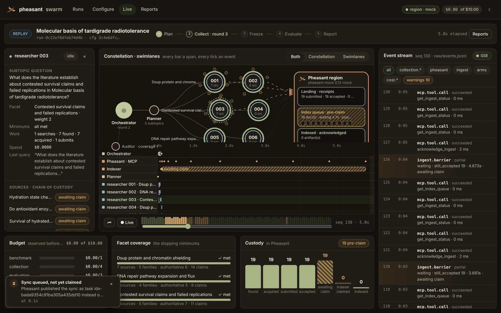

## Reports and agent traces

**Reports** renders the run's own Markdown. **Agent traces** is every actor's
whole record: the orchestration, each research branch and each arm.

- A waterfall of the actor's span tree on the run's clock (zoomable), with
  every event inside the span that recorded it.
- An arm's answer span carries the question, the answer, its claims, its
  queries and what it read.

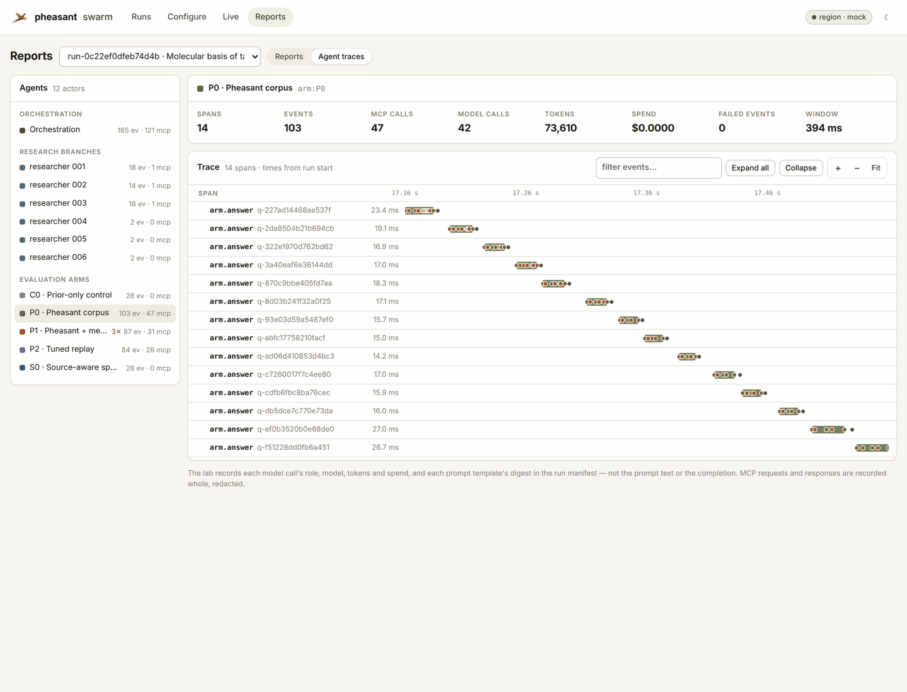

Each Pheasant call shows its request and response exactly as the region
answered. JSON inside a text block is decoded for reading, with a toggle back
to the record.


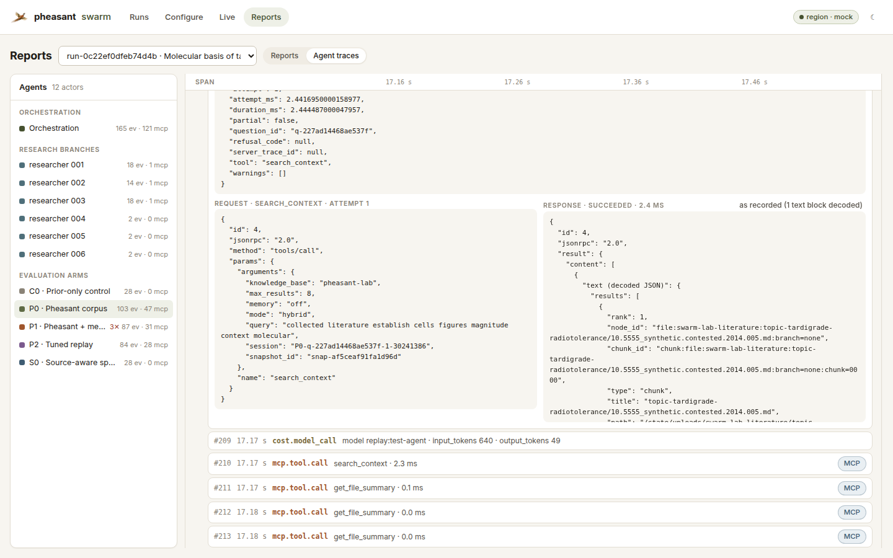

A research branch carries the claims it extracted.

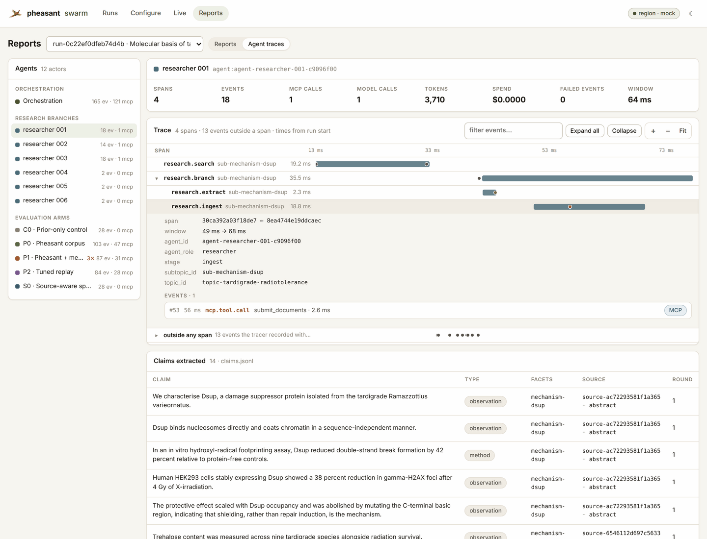

Events whose own span was never exported are placed by time and question, and
labelled `placed by time` / `placed by question`. Prompts and completions are
not recorded, only their digests, tokens and spend, and the page says so.

## Runs, and runs that outlive the console

**Launch run** starts `pheasant-lab run` detached. It is the supervised
pipeline, and it resumes any stage that crashes. Closing or restarting the
console does not stop it; a restarted console re-attaches. A run interrupted
any other way (a machine restart, a stage that crashed every attempt) is
marked **interrupted** and offers **Resume**, which continues from the run's
checkpoint. See [durability](durability.md).

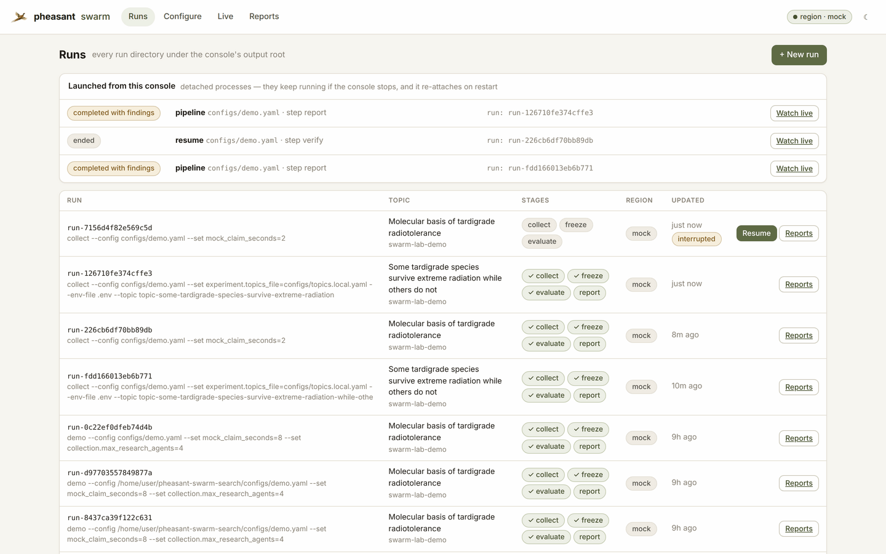
