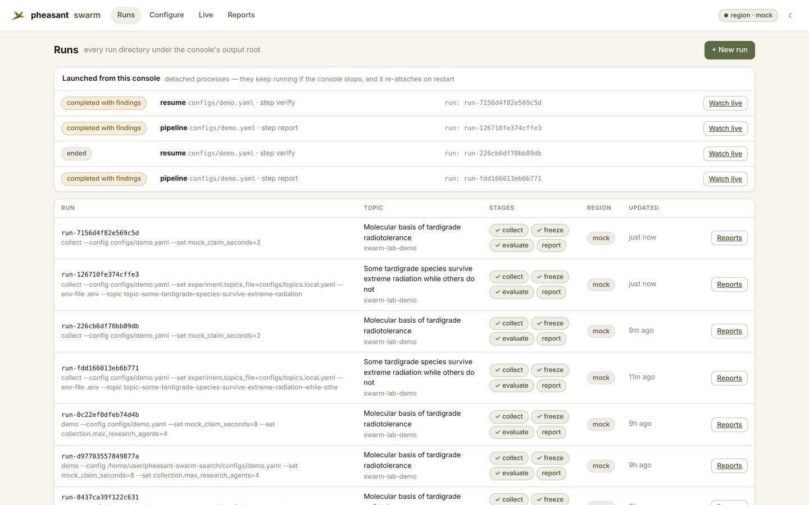

# Persistence and durability

What the lab keeps, where, and what happens to a run when something dies
partway through.

## What persists a run

A run is a directory under `experiment.output_root` (default `runs/`). No
database and no server holds anything a run needs. The console reads these
files and holds no state of its own.

| Path | What it is | Kind |
|---|---|---|
| `raw/*.jsonl` | Events, spans, errors, the MCP transcript, sources, claims, receipts, questions, answers, proof. | **Authoritative.** Append-only; corrections supersede, nothing is rewritten. |
| `run-manifest.json` | Config digest, models, prompts, environment. | Written once at the start (forks are appended). |
| `resolved-config.redacted.yaml` | The resolved configuration the run used. | Written once at the start. |
| `state.json` | The **checkpoint**: completed stages, collection progress at its last round boundary, budget. | A convenience. Where it disagrees with `raw/`, `raw/` wins. |
| `benchmark/` | The frozen question set and its manifest. | Content-addressed; `verify` checks it. |
| `artifacts/` | Source metadata and permitted content. | Written once per source. |
| `metrics/`, `reports/`, `projections/run.duckdb` | Numbers, Markdown and the DuckDB projection. | **Derived.** `replay` and `report` rebuild them from `raw/`. |
| `integrity/checksums.sha256` | A digest of every file above. `integrity/torn/` holds any fragment cut off a crashed append. | Read by `verify`. |
| `supervisor/attempts.jsonl` | Every stage attempt `pheasant-lab run` made: exit code, crashed or exited. | Operational; outside the checksums. |
| `mock-region.json` | The offline mock region's own state, so a resumed demo finds what it indexed. | Mock runs only. |

The Pheasant region holds the indexed corpus; the lab holds the receipts that
say what it sent and what came back. Console launches are files too, under
`<output_root>/.console/launches/`: one JSON record and one log per launch.

## How writes are made durable

- **Appends.** Each record is one line ending in a newline, written and
  flushed as it happens. Concurrent writers are serialised per file.
- **Whole-file writes.** The manifest, checkpoint, checksums, launch records
  and the console's topics file go through `durable_write_text`. It writes a
  temp file unique to the writer, `fsync`s it, renames it over the target and
  `fsync`s the directory. A crash leaves the old file or the new one, never
  half of either.
- **Checkpoints are barriers.** Before `state.json` is written, every raw file
  is `fsync`ed (`Tracer.sync`). A checkpoint can therefore never name work
  whose evidence is still in a page cache.
- **Torn tails are repaired, not ignored.** A process killed mid-append leaves
  a last line with no newline, and every reader after it would refuse the
  file. When a run resumes, the fragment is moved to `integrity/torn/`, the
  file is cut back to its last complete line, and the cut is recorded as a
  `run.repaired` event. A malformed line in the *middle* of a file is damage,
  not a crash. It stays an error for `verify` to report.

## How execution survives failure

| Failure | What happens |
|---|---|
| A model call gets `429`, `5xx`, a timeout or a dropped connection. | Retried up to 4 attempts, with exponential backoff; a server's `Retry-After` is honoured, `0` included. Every retry is recorded in `errors.jsonl` as `resolution: retried`. Authentication failures, bad requests and wrong-shape replies are not retried. |
| A Pheasant MCP call fails transiently. | Retried by the client's own policy: idempotent calls only, or calls carrying an idempotency key. |
| One research branch raises. | Recorded; the round continues. One failed subtopic is a coverage gap the audit reports. |
| The process dies **during collection**. | `collect --resume <run>` rehydrates the source registry and evidence ledger from `raw/` and continues from the last round boundary. Each boundary is checkpointed as `collect_progress`. Admitted sources are not admitted again, claims are content-addressed and fold, and a re-submitted document carries the same idempotency key. The documents the dead process submitted still cross the index barrier, because the receipt ledger is restored from `ingest-receipts.jsonl`. |
| The process dies **during evaluation**. | `evaluate --run <run>` reuses every answer already recorded in `answers.jsonl`, keyed by (arm, question, repetition), and asks only for the rest. Nothing is paid for twice. A failed answer is asked again. |
| The process dies anywhere else. | Freezing, replay, report and verify are idempotent over `raw/` and simply run again. |
| Spend before a crash. | A resumed run re-commits what the previous process spent before it reserves anything new, so a crash cannot double the budget. |
| An unhandled exception. | The CLI exits `3`, never `1`. `1` means "completed, and a decision failed" (a gate, a non-inferiority test): a result to keep, not a crash to resume. |
| The console stops, crashes or restarts. | Runs are not its children in any way that matters: each launch is its own session and writes to a log file, not a pipe. A restarted console reloads its launch records, re-attaches to runs still going, and marks the rest `interrupted`. |
| The machine restarts. | Every run on disk is resumable: **Resume** on the Runs page, or `pheasant-lab run --resume <run>`. |

### `pheasant-lab run`: the supervised pipeline

```bash
pheasant-lab run --config configs/experiment.yaml --topic <id>   # a new run
pheasant-lab run --config configs/experiment.yaml --resume <run> # carry one on
```

`run` drives collect → freeze → evaluate → replay → report → verify, each
stage as its own child process, so a crash is an exit status rather than the
end of the run. The exit status decides what happens next:

- `0` / `1`: next stage.
- `2` (refused: config, capability, drifted snapshot): stop, because asking
  again cannot change the answer.
- `130` (interrupted by a person): stop.
- Anything else (a crash, `SIGKILL`, out of memory): resume the same stage
  after 2s, 4s… up to `--attempts` (default 3). After that the run stops
  *resumable*, not failed.

Stages the checkpoint records as completed are skipped, and a lock file
(`supervisor/lock`, taken over when its holder is dead) stops two
supervisors driving one run at once. The console's **Launch run** and
**Resume** buttons start exactly this command, detached.




## How this is tested

`tests/integration/test_durability.py` kills the real CLI with `os._exit`
(no `finally`, no flush, the way `SIGKILL` arrives) after leaving half a JSON
line at the end of `events.jsonl`. It does this mid-round during collection
and mid-way through evaluation (`tests/fixtures/faults/crashy_cli.py`), then
asserts the strongest property available: **the crashed and resumed run
reaches the same corpus and the same metrics as a run that never crashed**,
with no row written twice and every submitted document indexed.

## What this does not cover

- A disk that lies about `fsync`, or a filesystem without atomic rename
  (some network mounts). Keep `runs/` on a local disk.
- A provider that bills a request and then fails it with `429`/`5xx`. Retries
  happen inside the one reservation the call already held; the ledger
  reconciles what each successful call reports.
- A collection's time budget restarts on resume. The clock that stopped with
  the process is not added back.
